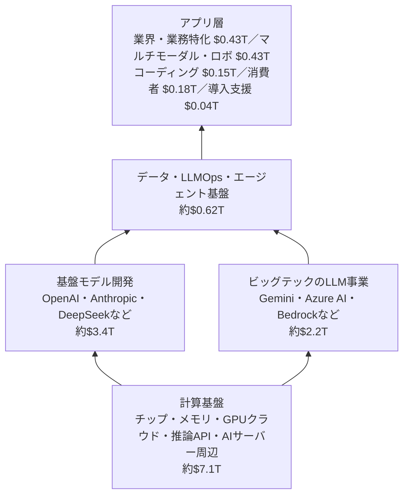

LLMを使う事業を、価値の流れに沿って下の層から並べると次のようになる。

```mermaid
flowchart BT
  A["計算基盤<br/>チップ・メモリ・GPUクラウド・推論API・AIサーバー周辺<br/>約$7.1T"] --> B["基盤モデル開発<br/>OpenAI・Anthropic・DeepSeekなど<br/>約$3.4T"]
  A --> C["ビッグテックのLLM事業<br/>Gemini・Azure AI・Bedrockなど<br/>約$2.2T"]
  B --> D["データ・LLMOps・エージェント基盤<br/>約$0.62T"]
  C --> D
  D --> E["アプリ層<br/>業界・業務特化 $0.43T／マルチモーダル・ロボ $0.43T<br/>コーディング $0.15T／消費者 $0.18T／導入支援 $0.04T"]
```

